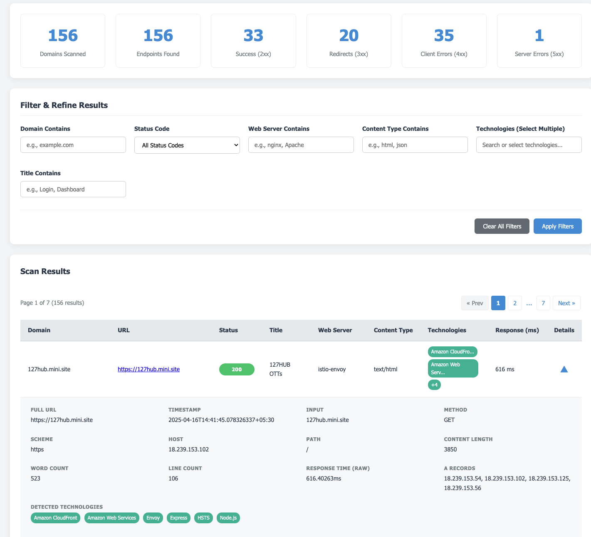

# HTTPx Visualizer

A browser-based, single-file tool to visually parse, filter, sort, and explore HTTPx JSON output. This enhanced version provides a more refined UI and advanced features for efficient analysis of web scan results.

> [!NOTE]
> MADE BY : Claude 3.7 Sonnet (Thinking) and enhanced by Gemini 2.5 pro 😝

---

## Features

- **Modern UI/UX:** Clean, responsive interface built with vanilla HTML, CSS, and JavaScript.
- **Drag & Drop Upload:** Easily load your HTTPx JSON files.
- **Statistical Overview:** Quickly grasp key metrics (total domains, endpoints, status code counts).
- **Advanced Filtering:**
  - Filter by Domain, Status Code (ranges like 2xx, 3xx), Web Server, Content Type, and Page Title.
  - **Multi-Select Technology Filter:** Filter results based on detected technologies using a searchable dropdown and visual pills.
- **Interactive Results Table:**
  - **Sortable Columns:** Sort data by Domain, URL, Status Code, Title, Web Server, Content Type, Technology Count, and Response Time.
  - **Pagination:** Handles large datasets efficiently with navigation controls.
  - **Detailed View:** Expand rows to see all fields from the JSON data, including request/response details and a response body preview.
  - **Tech Tags:** See detected technologies directly in the table.
  - **Clear Status Indicators:** Color-coded status code pills.
- **CSV Export:** Export the currently _visible_ filtered and sorted data to a CSV file.
- **Standalone:** Runs entirely in the browser – no server-side components needed. Just a single HTML file.

## How to Use

1. **Get the File:** Download the `httpx-visualizer.html` file from this repository.
2. **Open in Browser:** Open the downloaded HTML file in your web browser (Firefox, Chrome, Edge, etc.).
3. **Upload Data:**
   - Run your `httpx` scan with the `-json` flag:

```bash
cat input.txt | httpx -nc -silent -random-agent -probe -cdn -asn -extract-fqdn -cname -ip -td -server -favicon -j > results.json
```

- Drag and drop the generated `results.json` file onto the upload area in the visualizer, or click the area to browse and select the file.

4. **Explore:** The visualizer will process the file and display the results. Use the filters, sorting, pagination, and expandable rows to analyze your data.

## Input Format

This tool requires JSON output generated by the [HTTPx tool](https://github.com/projectdiscovery/httpx) using the `-json` flag. Ensure your `httpx` command includes flags for the data you want to visualize (e.g., `-tech-detect`, `-title`, `-status-code`, etc.).

```json
{
  "tool_name": "httpx",
  "results": [
    {
      "domain_name": "www.xablekart.com",
      "results": [
        {
          "timestamp": "2025-04-16T14:41:47.387616028+05:30",
          "port": "443",
          "url": "https://www.xablekart.com",
          "input": "www.xablekart.com",
          "location": "https://xablekart.com/",
          "title": "301 Moved Permanently",
          "scheme": "https",
          "webserver": "nginx/1.24.0 (Ubuntu)",
          "content_type": "text/html",
          "method": "GET",
          "host": "206.19.140.188",
          "path": "/",
          "time": "428.021993ms",
          "a": ["206.19.140.188"],
          "tech": ["Nginx:1.24.0", "Ubuntu"],
          "words": 6,
          "lines": 7,
          "status_code": 301,
          "content_length": 178,
          "failed": false,
          "knowledgebase": {
            "PageType": "error",
            "pHash": 0
          },
          "resolvers": ["8.8.8.8:53", "172.20.0.10:53"],
          "body_domains": ["xablekart.com"]
        }
      ]
    },
    {
      "domain_name": "www.xablekart.com",
      "results": [
        {
          "timestamp": "2025-04-16T14:41:47.387616028+05:30",
          "port": "443",
          "url": "https://www.xablekart.com",
          "input": "www.xablekart.com",
          "location": "https://xablekart.com/",
          "title": "301 Moved Permanently",
          "scheme": "https",
          "webserver": "nginx/1.24.0 (Ubuntu)",
          "content_type": "text/html",
          "method": "GET",
          "host": "206.19.140.188",
          "path": "/",
          "time": "428.021993ms",
          "a": ["206.19.140.188"],
          "tech": ["Nginx:1.24.0", "Ubuntu"],
          "words": 6,
          "lines": 7,
          "status_code": 301,
          "content_length": 178,
          "failed": false,
          "knowledgebase": {
            "PageType": "error",
            "pHash": 0
          },
          "resolvers": ["8.8.8.8:53", "172.20.0.10:53"],
          "body_domains": ["xablekart.com"]
        }
      ]
    }
  ]
}
```

#### OR

```json
{"timestamp":"2025-04-17T17:04:44.911489+05:30","url":"http://atos.example.com","input":"atos.example.com","error":"cause=\"no address found for host\"","words":0,"lines":0,"status_code":0,"content_length":0,"failed":true}

{"timestamp":"2025-04-17T17:04:44.911727+05:30","url":"http://ati.example.com","input":"ati.example.com","error":"cause=\"no address found for host\"","words":0,"lines":0,"status_code":0,"content_length":0,"failed":true}

{"timestamp":"2025-04-17T17:04:44.973633+05:30","url":"http://aegis.example.com","input":"aegis.example.com","error":"cause=\"no address found for host\"","words":0,"lines":0,"status_code":0,"content_length":0,"failed":true}

{"timestamp":"2025-04-17T17:04:45.003663+05:30","url":"http://archiva.example.com","input":"archiva.example.com","error":"cause=\"no address found for host\"","words":0,"lines":0,"status_code":0,"content_length":0,"failed":true}

{"timestamp":"2025-04-17T17:04:45.037881+05:30","url":"http://anon.example.com","input":"anon.example.com","error":"cause=\"no address found for host\"","words":0,"lines":0,"status_code":0,"content_length":0,"failed":true}

{"timestamp":"2025-04-17T17:04:45.049445+05:30","url":"http://aig.example.com","input":"aig.example.com","error":"cause=\"no address found for host\"","words":0,"lines":0,"status_code":0,"content_length":0,"failed":true}

{"timestamp":"2025-04-17T17:04:45.277696+05:30","cdn_name":"aws","cdn_type":"cloud","port":"443","url":"https://amzn.example.com","input":"amzn.example.com","scheme":"https","content_type":"text/html","method":"GET","host":"1.1.1.210","path":"/","time":"357.767917ms","a":["18.1.1.210"],"cname":["ec2-18-143-1-210.ap-southeast-1.compute.amazonaws.com"],"tech":["HSTS"],"words":964,"lines":50,"status_code":404,"content_length":2967,"failed":false,"knowledgebase":{"PageType":"error","pHash":0},"resolvers":["10.2.0.1:53","8.8.8.8:53"],"body_fqdn":["www.example.com"],"body_domains":["example.s3.ap-southeast-1.amazonaws.com","example.com"]}

{"timestamp":"2025-04-17T17:04:45.27781+05:30","cdn_name":"aws","cdn_type":"cloud","port":"443","url":"https://accenture.example.com","input":"accenture.example.com","scheme":"https","content_type":"text/html","method":"GET","host":"1.1.11.119","path":"/","time":"409.31775ms","a":["18.1.11.119"],"cname":["ec2-18-1-11-119.ap-southeast-1.compute.amazonaws.com"],"tech":["HSTS"],"words":964,"lines":50,"status_code":404,"content_length":2967,"failed":false,"knowledgebase":{"PageType":"error","pHash":0},"resolvers":["8.8.4.4:53"],"body_fqdn":["www.example.com"],"body_domains":["example.s3.ap-southeast-1.amazonaws.com","example.com"]}

{"timestamp":"2025-04-17T17:04:45.279179+05:30","cdn_name":"aws","cdn_type":"cloud","port":"443","url":"https://adidas.example.com","input":"adidas.example.com","scheme":"https","content_type":"text/html","method":"GET","host":"1.215.74.222","path":"/","time":"404.198333ms","a":["1.215.74.222"],"cname":["ec2-1-215-74-222.ap-southeast-1.compute.amazonaws.com"],"tech":["HSTS"],"words":964,"lines":50,"status_code":404,"content_length":2967,"failed":false,"knowledgebase":{"PageType":"error","pHash":0},"resolvers":["8.8.8.8:53"],"body_fqdn":["www.example.com"],"body_domains":["example.s3.ap-southeast-1.amazonaws.com","example.com"]}

{"timestamp":"2025-04-17T17:04:45.279279+05:30","cdn_name":"aws","cdn_type":"cloud","port":"443","url":"https://airindia1.example.com","input":"airindia1.example.com","scheme":"https","content_type":"text/html","method":"GET","host":"1.251.39.217","path":"/","time":"31.770834ms","a":["1.251.39.217"],"cname":["ec2-1-251-39-217.ap-southeast-1.compute.amazonaws.com"],"tech":["HSTS"],"words":964,"lines":50,"status_code":404,"content_length":2967,"failed":false,"knowledgebase":{"PageType":"error","pHash":0},"resolvers":["8.8.8.8:53"],"body_fqdn":["www.example.com"],"body_domains":["example.s3.ap-southeast-1.amazonaws.com","example.com"]}
```

## UI look



### Example `httpx` command

```bash
cat input.txt | httpx -nc -silent -random-agent -probe -cdn -asn -extract-fqdn -cname -ip -td -server -favicon -j > results.json
```
